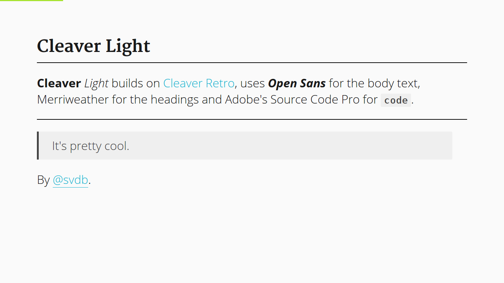

# Cleaver Light

**Cleaver** *Light* builds on [Cleaver Retro](http://github.com/jdan/cleaver-retro), uses ***Open Sans*** for the body text, Merriweather for the headings and Adobe's Source Code Pro for `code`.

# Usage

The easiest way to use Cleaver Light is to use the following YAML in your Markdown file: `theme: sjaakvandenberg/cleaver-light`.

You can also fork or clone it to create your own version of it.

    $ git clone git@github.com:sjaakvandenberg/cleaver-light.git

## File Structure

    . cleaver-light
    ├── cleaver-light.png
    ├── layout.mustache
    ├── README.md
    ├── script.js
    ├── settings.json
    ├── style.css
    └── template.mustache

## Credits

[Cleaver](https://github.com/jdan/cleaver) and [Cleaver Retro](http://github.com/jdan/cleaver-retro) by [Jordan Scales](https://github.com/jdan)
[Open Sans](https://www.google.com/fonts/specimen/Open+Sans) by [Steve Matteson](https://en.wikipedia.org/wiki/Steve_Matteson)
[Merriweather](https://www.google.com/fonts/specimen/Merriweather) by [Eben Sorkin](http://sorkintype.com/)
[Source Code Pro](https://github.com/adobe-fonts/source-code-pro) by [Paul Hunt](https://www.adobe.com/products/type/font-designers/paul-hunt.html)
